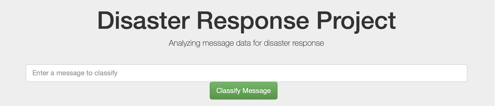
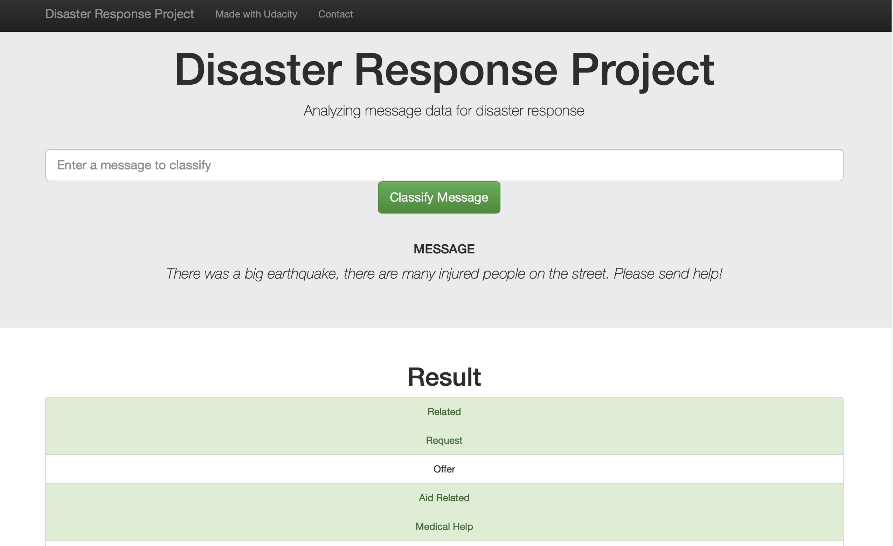
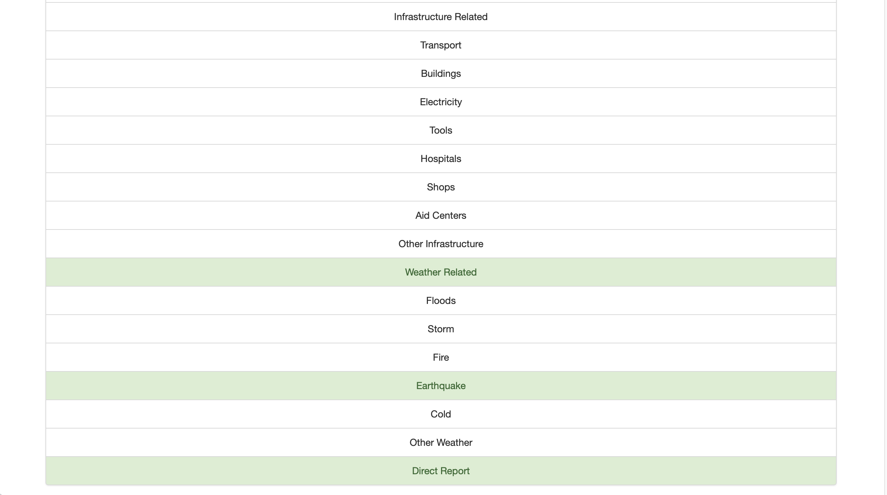
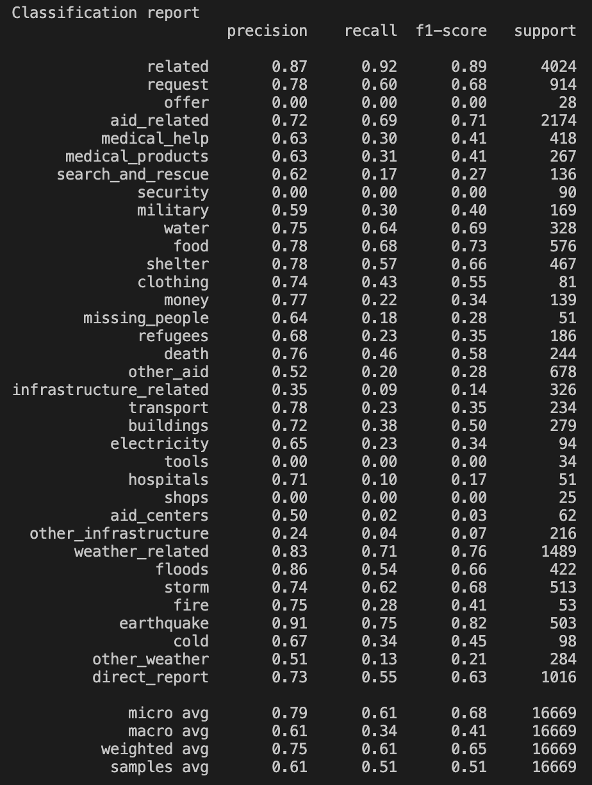

# Project-2--Disaster-Response-Pipeline-Udacity

# Goal

This project creates a **machine learning pipeline** to classify disaster events from a dataset [Figure Eight](https://appen.com) containing real messages. It includes a **web app** where an emergency worker can enter a new message and get classification results in different categories.

# Installation

 - Python3
 - Machine Learning Libraries: `NumPy`, `Pandas`, `Scikit-Learn`
-  Natural Language Process Libraries: `nltk`
-  SQLlite Database Libraries: `SQLalchemy`
-  Model Loading and Saving Library: `Pickle`
-  Web App and Data Visualization: `Flask`, `Plotly`

### Instructions for execution:
1. Run the following commands in the **project's root directory** to set up your database and model.

    - To run **ETL pipeline** that cleans data and stores in database
        `python data/process_data.py data/disaster_messages.csv data/disaster_categories.csv data/disaster_response.db`
    - To run **ML pipeline** that trains classifier and saves
        `python models/train_classifier.py data/disaster_response.db models/classifier.pkl`

2. Run the following command in the **app's directory** to run your **web app**.
    `python run.py`

3. Go to http://0.0.0.0:3001/ to see the web app.

# File Description

The **notebooks folder** contains two jupyter notebooks that help to understanding how the pipeline scripts are built step by step:

- **ETL Pipeline Preparation**: loads the datasets, merges them, cleans the data and stores them in a SQLite database.
- **ML Pipeline Preparation**: loads the dataset from SQLite database, splits data into train and test set, builds a text preprocessing and ML pipeline, trains and tunes models using GridSearch (SVM, Random Forest), output reults on the test set and export the final model as a pickle file.

**Python scripts**:

- `data/process_data.py` - ETL pipeline 
- `models/train_classifier.py` - ML Pipeline
- `app/run.py` - Flask Web App

# Results

The final output of the project is an **interactive web app** that takes a **message from the user** as an input and then **classifies it** into the respective categories.

**Classification Report running a Linear Support Vector Machine Classifier**.

# Licensing, Authors, Acknowledgments

